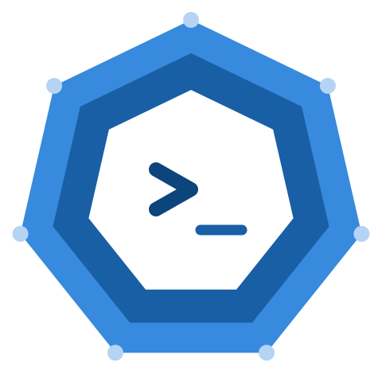
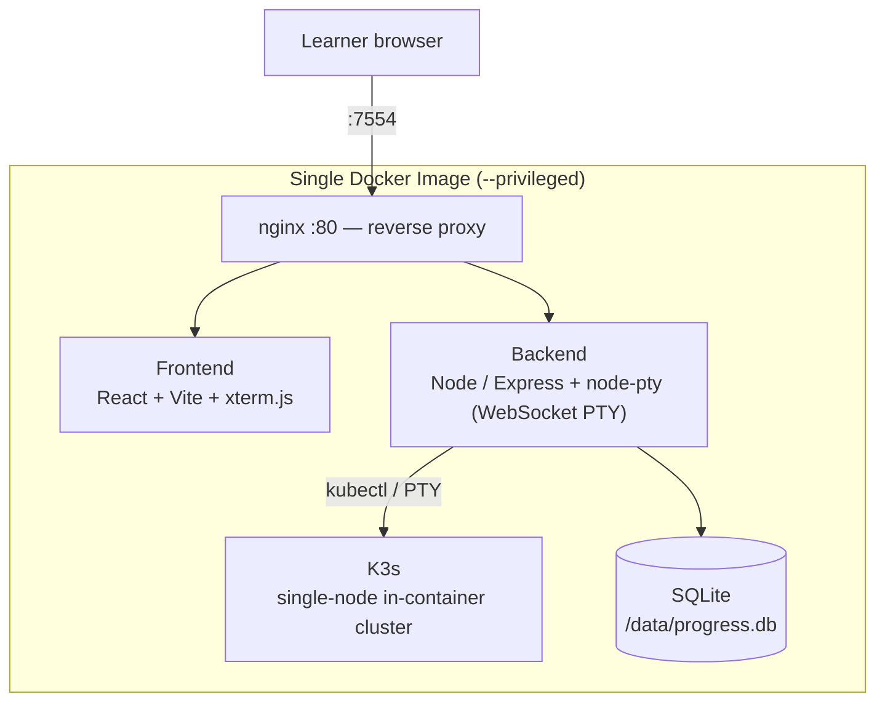

<div align="center">



# KubeKosh — RootNode Academy Edition

**A browser-based Kubernetes lab for hands-on learners.**
Real K3s. Real `kubectl`. Instant validation. No cloud account, no local cluster.

[](LICENSE)
[](#)
[](https://k3s.io)
[](https://docs.docker.com/get-docker/)
[](https://github.com/ced4568)

</div>

---

> **Attribution.** This is a branded, modified fork of the excellent
> [`zeborg/kubekosh`](https://github.com/zeborg/kubekosh), licensed under Apache 2.0.
> RootNode Academy adds custom scenarios, branding, and multi-student deployment tooling on
> top of the upstream project. Original copyright and license notices are preserved in
> [`LICENSE`](LICENSE). Modified files are marked per Apache 2.0 §4. Full credit to
> the original author for the core platform.

---

## What It Is

KubeKosh runs a real single-node [K3s](https://k3s.io) cluster inside one Docker
container and pairs it with a browser terminal and automated scenario validation.
A learner opens a tab, gets a live cluster, runs real `kubectl`, and clicks **Validate**
to check their work against actual cluster state.

In the RootNode Academy curriculum this is the **capstone rung** — the Kubernetes & DevOps
track that sits on top of the Linux / Git / Docker foundations. It is aimed at the
advanced learner (roughly 14+), not the absolute beginner.

---

## Quick Start

**Prerequisite:** [Docker](https://docs.docker.com/get-docker/)

```bash
docker run -itd --name kubekosh --privileged -p 7554:80 ced4568/kubekosh:latest
```

Open **http://localhost:7554** and wait ~30s for the *Cluster Ready* indicator to turn green.

> `--privileged` is required — K3s needs kernel namespaces and cgroups.
> **Do not expose this container directly to the public internet.** It is a teaching
> sandbox. Multi-student exposure is handled by the deployment layer below, not by
> publishing the raw container.

### Persist Progress

```bash
docker run -itd --name kubekosh --privileged -p 7554:80 \
  -v <host_dir>:/data ced4568/kubekosh:latest
```

Progress is stored in SQLite at `/data/progress.db`. Mount a host directory to `/data`
to keep progress across restarts — one volume per student.

### Build From Source

```bash
docker build -t kubekosh .
# multi-platform
docker buildx build --platform linux/amd64,linux/arm64 -t kubekosh .
```

---

## What's Inside

| Bundle | Focus | Exam Mode |
| ------ | ----- | --------- |
| 🌱 Kubernetes Basics | Core concepts | 60 min |
| 🧑‍✈️ Kubernetes Administrator | CKA | 120 min |
| 🛠️ Kubernetes Developer | CKAD | 120 min |
| 🛡️ Kubernetes Security | CKS | 120 min |

**Scenario types**

- **Task** — hands-on challenge in the live terminal; **Validate** auto-checks cluster state.
- **MCQ** — multiple choice with a detailed explanation on submission.

Custom RootNode Academy scenarios live alongside upstream ones in `scenarios/data/` and are
grouped into bundles in `scenarios/bundles/`. See [`scenarios/SCHEMA.md`](scenarios/SCHEMA.md).

---

## Architecture



| Component | Technology |
| --------- | ---------- |
| Frontend  | React + Vite, `xterm.js` |
| Backend   | Node.js / Express, `node-pty` WebSocket PTY |
| Cluster   | K3s (single-node, in-container) |
| Proxy     | nginx on port `80`, mapped to host `7554` |
| Storage   | SQLite (`better-sqlite3`) at `/data/progress.db` |

Everything runs inside one image managed by `scripts/entrypoint.sh`.

---

## Multi-Student Deployment (RootNode Academy addition)

The upstream project assumes one learner, one container. RootNode Academy runs it across three
delivery modes. **Never publish the raw privileged container** — front it with isolation.

| Mode | Provisioning | Isolation |
| ---- | ------------ | --------- |
| In-person camp | Pre-spun container per seat, torn down after | Lab VLAN, no public ingress |
| Live cohort | Container per enrolled student for the session window | Per-student auth at the proxy |
| Self-paced | On-demand spin-up per session, idle-timeout teardown | Per-user volume + auth + resource limits |

Hardening checklist for shared infra:

- One container **per student** — never share a cluster between learners.
- Apply CPU/memory limits so one runaway pod can't starve a host.
- Put authentication in front (proxy-level), never expose `:7554` to the internet.
- Persist each student's `/data` to a dedicated volume.
- Idle-timeout + auto-teardown for self-paced sessions to control cost.

---

## Repository Layout

```
scenarios/
├── data/         # one JSON file per scenario  -> <scenario-id>.json
├── bundles/      # one JSON file per bundle     -> <bundle-id>.json
└── SCHEMA.md     # full schema reference

backend/  server.js      # Express API + WebSocket PTY
frontend/ src/           # React + Vite SPA
scripts/  entrypoint.sh  # container startup (k3s -> API -> nginx)
          nginx.conf     # reverse-proxy config
```

---

## Authoring Scenarios

Each scenario is one JSON file in `scenarios/data/`; each bundle is one JSON file in
`scenarios/bundles/`. See [`scenarios/SCHEMA.md`](scenarios/SCHEMA.md) for the full schema.

**Task checklist**
- `validation.commands` — idempotent `kubectl` only
- `setup_commands` / `teardown_commands` — `kubectl` or native Ubuntu only

**MCQ checklist**
- `correct_option` must match an `options[].id`
- always include an `explanation`

Hot-reload while authoring (no rebuild):

```bash
docker run --rm -itd --privileged -p 7554:80 --name kubekosh \
  -v $PWD/scenarios:/app/scenarios ced4568/kubekosh:latest
curl -X POST http://localhost:7554/api/cache/reload
```

---

## License

Apache 2.0 — see [`LICENSE`](LICENSE). Original work © the `zeborg/kubekosh` authors.
Modifications © RootNode Academy / Chase Dumphord (ced4568).